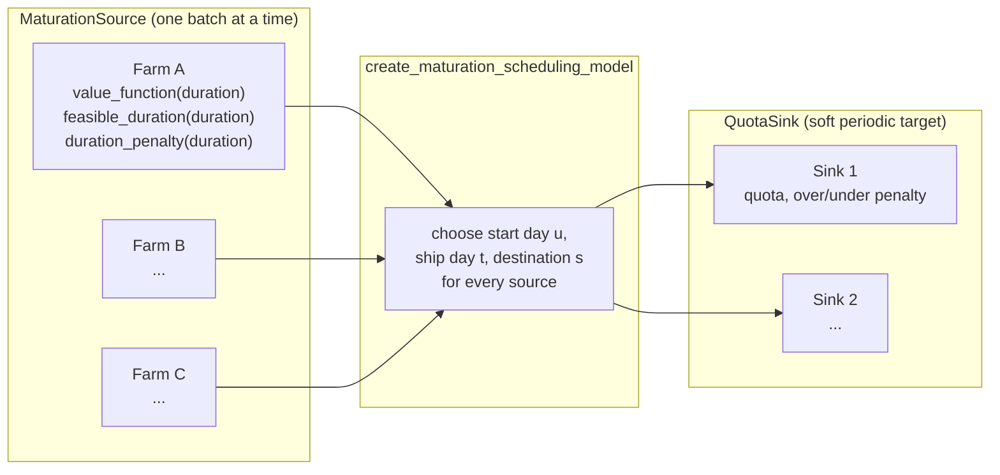

# Case study: from an academic paper to open-source optimization in a week

**TL;DR:** We took a 2026 operations-research paper on poultry production-distribution
scheduling, implemented its exact mixed-integer model in
[SupplyChainOptimization.jl](https://github.com/SupplyChef/SupplyChainOptimization.jl), then
generalized the implementation so it isn't about poultry at all — it's about *any* supply chain
where a batch's value grows while it's held and must ship to meet a periodic delivery target.
Cheese aging, wine maturation, and shelf-life produce inventory all fit the same two node types.

## The paper

Gbéya, Darvish, Renaud and Coelho (2026), *"Integrated Poultry Production-Distribution
Optimization,"* CIRRELT-2026-10, models a real operational problem: a network of farms each
raise one flock of birds at a time. A bird's weight grows roughly linearly with age, but only a
band of weights around a target is sellable at full value — under- or over-shoot it and you eat
a discount. Each farm chooses when to start a new flock and when to ship it, and slaughterhouses
have daily intake quotas they'd rather hit than miss (in either direction). The paper calls this
the **Integrated Poultry Production-Distribution Problem (IPPDP)** and formulates it as a MILP:
choose every farm's start day, ship day, and destination to minimize transportation cost plus
weight-deviation penalties plus quota-deviation penalties.

## The implementation

`SupplyChainOptimization.create_maturation_scheduling_model` builds the paper's formulation
directly — the same binary start/ship-day variables, the same quota-deviation variables, the
same four-way cost decomposition the paper reports in its Figure 2:

```
OF = OF_d (transportation) + OF_w (weight/value deviation) + OF_q+ (overproduction) + OF_q- (underproduction)
```

But nothing about *how* a batch's value evolves is hard-coded. A farm is a
[`MaturationSource`](https://github.com/SupplyChef/SupplyChainModeling.jl) — a location holding
one batch at a time, exposing three functions of duration: `value_function`, `feasible_duration`,
and `duration_penalty`. A slaughterhouse is a [`QuotaSink`](https://github.com/SupplyChef/SupplyChainModeling.jl) —
a location with a soft periodic delivery target. The model only ever calls those three functions;
it never assumes birds, weight, or growth.



That's the whole generalization: swap what `value_function`/`feasible_duration`/`duration_penalty`
compute, and the same model that schedules poultry flocks schedules cheese wheels, wine barrels,
or produce lots with a hard shelf life:

| Generic construct | Poultry | Cheese aging | Fresh produce (shelf-life) |
|---|---|---|---|
| `MaturationSource` | a farm | an aging cave | a packing facility/lot |
| `value_function(duration)` | weight at age `duration` | moisture/flavor development | constant |
| `feasible_duration` | within the target weight band | within the aging window | age ≤ shelf life |
| `duration_penalty` | off-target-weight discount | early/late-release discount | none |
| `QuotaSink` | a slaughterhouse | a distributor | a retail chain |

Full write-up, both `add_product!` forms (a convenience form for value that rises toward a
target, and a fully custom form for arbitrary curves), and a worked shelf-life example are in the
[Maturation Scheduling docs](https://SupplyChef.github.io/SupplyChainOptimization.jl/dev/maturation%20scheduling/).

## Does it actually replicate the paper?

We reconstructed the paper's Section 6.1 instance-generation recipe — capacity and growth-rate
ranges, weight-band deviation parameters, the delivery calendar, the quota derivation — using
only the public `MaturationSource`/`QuotaSink`/`create_maturation_scheduling_model` API (no
poultry-specific code path). Since the paper uses a different random seed (and one part of its
quota-derivation recipe is reconstructed from prose, not a published formula), this doesn't
claim to numerically match the paper's own figures. What it does show is a real, solved instance
(60 farms, 1 slaughterhouse, 6-week horizon) whose cost decomposes exactly like the paper's own
Figure 2:

| Component | Value |
|---|---|
| `OF` (total cost) | 321,661.16 |
| `OF_d` (transportation) | 303,539.16 |
| `OF_w` (weight deviation) | 0.00 |
| `OF_q+` (overproduction) | 257.00 |
| `OF_q-` (underproduction) | 17,865.00 |

Transportation dominates the total, as you'd expect in a real distribution problem; every
shipped batch landed inside its acceptable weight band (zero deviation cost); and quota misses
are a small fraction of total volume shipped. The first version of this replication test was
actually degenerate — a unit-scaling mistake meant *no* farm ever shipped anything, because a
bird's transport cost was priced on the same scale as the quota penalty on a grid where
distances run into the hundreds. Fixing that (and adding a regression test that catches it)
turned a trivial zero-cost solution into the numbers above.

## Is the matheuristic worth using here?

We also built a generic large-neighborhood-search / RINS-style matheuristic
(`matheuristic_optimize!`) that works on *any* model this package produces — tested against both
the maturation-scheduling model above and the package's existing network design model. Honest
result: on the instance sizes we benchmarked (60 farms/1 sink and 200 farms/3 sinks), it does
**not** measurably beat HiGHS's own direct solve, because HiGHS proves global optimality quickly
at those scales — there's no gap left to close. It doesn't regress anything either. Whether it
helps on genuinely hard instances (larger capacitated facility-location problems, or against a
commercial solver like Gurobi) is open — see the tracking issue.

## Try it

```julia
using SupplyChainModeling
using SupplyChainOptimization

sc = SupplyChain(30)
bird = Product("bird")
add_product!(sc, bird)

farm = MaturationSource("Farm A", Location(46.8, -71.2); capacity=10_000, changeover_periods=3)
add_product!(farm, bird; initial_value=45.0, maturation_rate=60.0, target_value=2250.0,
                         acceptable_deviation_under=0.1, acceptable_deviation_over=0.1,
                         extended_deviation_under=0.05, extended_deviation_over=0.05,
                         underrun_unit_penalty=0.001, overrun_unit_penalty=0.001)
add_maturation_source!(sc, farm)

slaughterhouse = QuotaSink("Slaughterhouse", Location(46.8, -71.2))
add_product!(slaughterhouse, bird; quota=15_000, underproduction_unit_penalty=1.0, overproduction_unit_penalty=1.0)
add_quota_sink!(sc, slaughterhouse)

optimize_maturation_schedule!(sc; transport_cost_per_distance=1.0, distance=haversine_km)
get_maturation_schedule(sc, farm, bird)
```

- Paper: Gbéya, Darvish, Renaud and Coelho (2026), *"Integrated Poultry Production-Distribution
  Optimization,"* CIRRELT-2026-10.
- Docs: [Maturation Scheduling](https://SupplyChef.github.io/SupplyChainOptimization.jl/dev/maturation%20scheduling/) · [Matheuristics](https://SupplyChef.github.io/SupplyChainOptimization.jl/dev/matheuristics/)
- Code: [SupplyChainModeling.jl](https://github.com/SupplyChef/SupplyChainModeling.jl) (node types) · [SupplyChainOptimization.jl](https://github.com/SupplyChef/SupplyChainOptimization.jl) (model + matheuristic)
