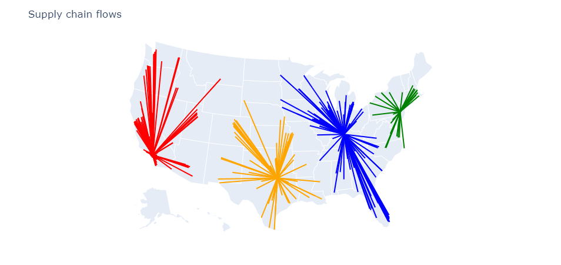

# SupplyChainOptimization.jl

SupplyChainOptimization.jl is a package for modeling and optimizing supply chains.

## Installation

SupplyChainOptimization can be installed using the Julia package manager.
From the Julia REPL, type `]` to enter the Pkg REPL mode and run

```
pkg> add SupplyChainOptimization
```

SupplyChainOptimization.jl needs an optimizer to find optimal solutions to supply chain design problems. By default the [HiGHS](https://github.com/jump-dev/HiGHS.jl) solver is used. It is a powerful open-source solver. Other solvers can be used. The solver must be compatible with JuMP and must be able to
solve mixed integer programming problems. Solvers that meet these criteria include:

- [Cbc](https://github.com/jump-dev/Cbc.jl)
- [SCIP](https://github.com/scipopt/SCIP.jl)
- [Gurobi](https://github.com/jump-dev/Gurobi.jl)
- [CPLEX](https://github.com/jump-dev/CPLEX.jl)
- [Xpress](https://github.com/jump-dev/Xpress.jl)

## Getting started

Optimizing the supply chain is done in three steps:

- Modeling the supply chain using built-in concepts such as storage locations and customers.
- Invoke the solver. This step may take more or less time depending on the difficulty of the problem.
- Querying and visualizing the results.

In the example below we search for the best storage locations to use to supply a set of customers. We first download data on
US cities. Then we create one product, a set of 40 possible storage locations and a set of 350 customers both distributed throughout the US.
We specify the cost of operating each storage location and the cost of shipping the product from each storage location to each customer. Finally we indicate the demand for each customer. Once this is done we optimize the network.

using CSV
using DataFrames
using SupplyChainOptimization

nm = tempname()
url = "https://raw.githubusercontent.com/plotly/datasets/master/2014_us_cities.csv"
download(url, nm)
us_cities = CSV.read(nm, DataFrame)
rm(nm)

sort!(us_cities, [:pop], rev=true)

sc = SupplyChain(1)

product = Product("Product 1")
add_product!(sc, product)

for r in eachrow(first(us_cities, 40))
    storage = Storage("Storage $(r.name)", Location(r.lat + 0.2, r.lon + 0.2, r.name);
            fixed_cost= 2_000_000 + r.pop / 2,
            opening_cost=0.0,
            closing_cost=0.0,
            initial_opened=false)
    add_product!(storage, product; initial_inventory=100_000)
    add_storage!(sc, storage)
end

for (i, r) in enumerate(eachrow(first(us_cities, 350)))
    customer = Customer("customer $i", Location(r.lat, r.lon, r.name))
    add_customer!(sc, customer)
    add_demand!(sc, customer, product, [r.pop / 10_000])
end

for c in sc.customers, s in sc.storages
    add_lane!(sc, Lane(s, c; unit_cost=haversine(s.location, c.location) / 250))
end

optimize_network!(sc)

After optimizing the network we can visualize the results.

```
plot_flows(sc; showlegend=false)
```



SupplyChainOptimization comes with a variety of built-in concepts including Customers, Lanes, Plants, Storages, and Suppliers.
Each of these concepts has attributes that are used to ensure constraints are met and costs are minimized.
