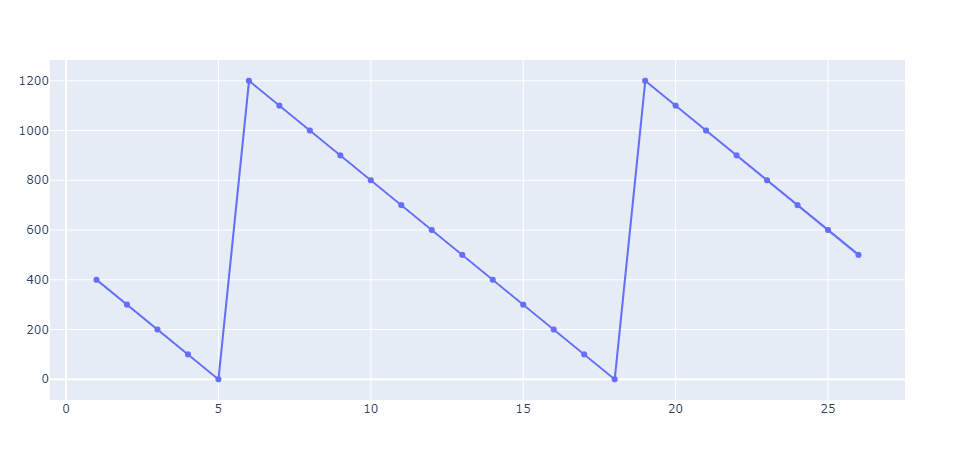

# Inventory Movements
Network optimization is mainly about long term inventory flows. In this example we will show to use SupplyChainOptimization to compute shorter term inventory movements and optimal ordering.

We will consider a simple network with one supplier, one storage location, one customer and a single product. The storage location must maintain enough inventory to meet the customer's demand for the product. The storage location can order inventory from the supplier. Each time it orders it pays an ordering cost. The storage location also pays a holding cost for any inventory left at the end of each time period. We want to find the best way to order inventory into the storage location. We consider a problem over 26 periods (this would be 6 months if each period represents weekly demand).

The problem is modeled and solved as shown below.

```@example continue=true
using HiGHS
using JuMP
using SupplyChainOptimization

Seattle = Location(47.608013, -122.335167)

sc = SupplyChain(26)

ordering_cost = 100

product = Product("Product 1"; unit_holding_cost=0.01)
add_product!(sc, product)

supplier = Supplier("Supplier 1", Seattle)
add_product!(supplier, product; unit_cost=0.0)
add_supplier!(sc, supplier)

storage = Storage("Storage 1", Seattle; 
            fixed_cost= 0, 
            initial_opened=true)
add_product!(storage, product; additional_stock_cover=0, initial_inventory=nothing)
add_storage!(sc, storage)

customer = Customer("Customer 1", Seattle)
add_customer!(sc, customer)
add_demand!(sc, customer, product; demand=[100.0 for i in 1:sc.horizon])

lane = Lane(supplier, storage; minimum_quantity=1.0)
add_lane!(sc, lane)
add_lane!(sc, Lane(storage, customer; minimum_quantity=1.0))

SupplyChainOptimization.create_network_optimization_model!(sc, HiGHS.Optimizer)
@objective(sc.optimization_model, Min, sum(sc.optimization_model[:used][lane, t] * ordering_cost for t in 1:sc.horizon) +
                                       sum(sc.optimization_model[:stored_at_start][product, storage, t] * product.unit_holding_cost for t in 1:sc.horizon) )
SupplyChainOptimization.optimize_network_optimization_model!(sc)

```

Once solve we can display the inventory at the storage location.

```
plot_inventory(sc, storage, product)
```

