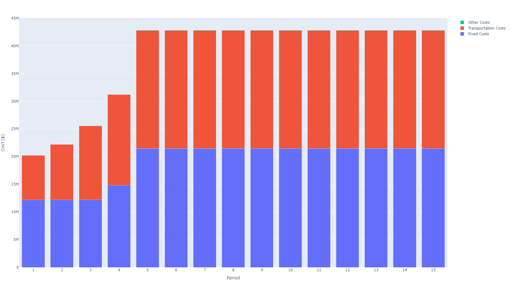
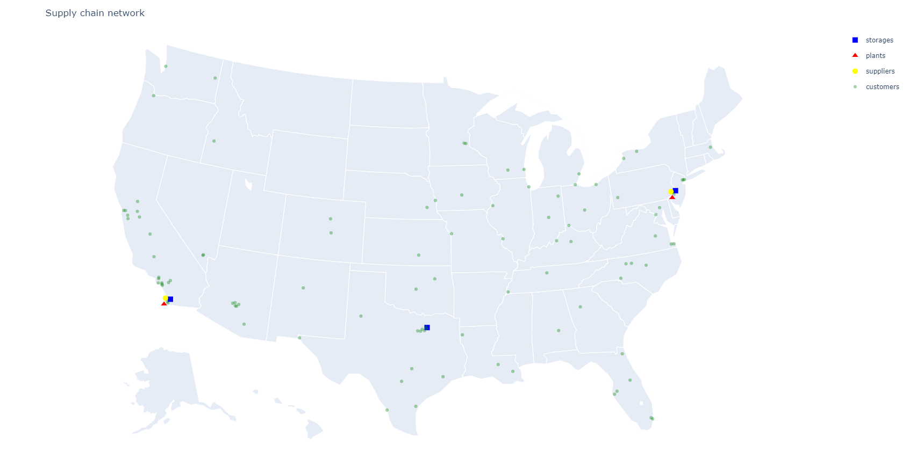

# Multi-period Optimization
In this section we will see how to use SupplyChainOptimization for multi-period network optimization. We will consider a use case
where demand is expected to grow over time. The setup is similar to the one in [Locations Optimization](@ref) with the difference that
we are looking at 15 years of data instead of 1.

```
using CSV
using DataFrames
using Cbc
using SupplyChainModeling
using SupplyChainOptimization

nm = tempname()
url = "https://raw.githubusercontent.com/plotly/datasets/master/2014_us_cities.csv"
download(url, nm)
us_cities = CSV.read(nm, DataFrame)
rm(nm)

sort!(us_cities, [:pop], rev=true)

sc = SupplyChain(15)

product1 = Product("Product 1")
product2 = Product("Product 2")
add_product!(sc, product1)
add_product!(sc, product2)

for r in eachrow(first(us_cities, 10))
    supplier = Supplier("Supplier $(r.name)", Location(r.lat + 0.2, r.lon - 0.2, r.name))
    add_product!(supplier, product1; unit_cost=1.0)
    add_supplier!(sc, supplier)
end

for r in eachrow(first(us_cities, 10))
    plant = Plant("Plant $(r.name)", Location(r.lat - 0.2, r.lon - 0.2, r.name); 
            fixed_cost= 6_000_000 + r.pop / 2, 
            initial_opened=false)
    add_product!(plant, product2; bill_of_material=Dict{Product, Float64}(product1 => 1.0), unit_cost=1.0)
    add_plant!(sc, plant)
end

for r in eachrow(first(us_cities, 10))
    storage = Storage("Storage $(r.name)", Location(r.lat + 0.2, r.lon + 0.2, r.name); 
            fixed_cost= 2_000_000 + r.pop / 2, 
            initial_opened=false)
    add_product!(storage, product2; initial_inventory=0, unit_holding_cost=0.01)
    add_storage!(sc, storage)
end

for (i, r) in enumerate(eachrow(first(us_cities, 100)))
    customer = Customer("customer $i", Location(r.lat, r.lon, r.name))
    add_customer!(sc, customer)
    add_demand!(sc, customer, product2; demand=[r.pop / (8_000 * (6-min(i, 5))) for i in 1:15])
end

for s in sc.suppliers, p in sc.plants
    add_lane!(sc, Lane(s, p, haversine(s.location, p.location) / 750))
end

for p in sc.plants, s in sc.storages
    add_lane!(sc, Lane(p, s, haversine(p.location, s.location) / 750))
end

for c in sc.customers, s in sc.storages
    add_lane!(sc, Lane(s, c, haversine(s.location, c.location) / 250))
end

optimize_network!(sc, Cbc.Optimizer)
```

The results show the network evolving in three phases:
- in the first phase, we open a plant and a storage location in Philadelphia to service the East Coast and a storage location in San Diego (supplied by the plant in Philadelphia) to service the West Coast.
- in the second phase, we open a third storage location in Dallas
- in the third phase, we open a plant in San Diego. 

Each time a new facility is opened the fixed costs go up but the transportation costs are reduced compared to the configuration where the facility stays closed. The costs can be visualized as below.



The final network configuration is shown in the figure below.

