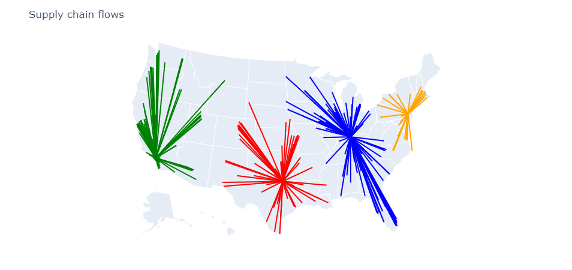
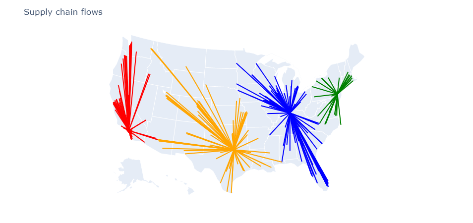

# Flow Optimization

In this section we will see how to best flow products through the supply chain. We will assume that we want to leverage the current network
(we will not open or close facilities -- we will do so in the [Locations Optimization](@ref) example). Finding the right facility to serve customers from can be simple if there are few constraints but can become challenging when considering constraints such as throughput limits or considering complex cost structures. We will start with a simple example and then show how to handle realistic constraints.

In the first example we consider four storage locations servicing 350 customers distributed throughout the US. The aim is to find which storage location service which customer. The setup is done as in the following code.

using CSV
using DataFrames
using SupplyChainModeling
using SupplyChainOptimization

nm = tempname()
url = "https://raw.githubusercontent.com/plotly/datasets/master/2014_us_cities.csv"
download(url, nm)
us_cities = CSV.read(nm, DataFrame)
us_cities[!,:name] = strip.(us_cities[!,:name])
rm(nm)

sort!(us_cities, [:pop], rev=true)

sc = SupplyChain(1)

product = Product("Product 1")
add_product!(sc, product)

for r in eachrow(us_cities[in(["Fort Worth", "Long Beach", "Philadelphia", "Louisville/Jefferson County"]).(us_cities.name), :])
    storage = Storage("Storage $(r.name)", Location(r.lat + 0.2, r.lon + 0.2, r.name);
            fixed_cost= 2_000_000 + r.pop / 2,
            opening_cost=0.0,
            closing_cost=0.0,
            initial_opened=false)
    add_product!(storage, product; initial_inventory=100_000)
    add_storage!(sc, storage)
end

for (i, r) in enumerate(eachrow(first(us_cities, 350)))
    customer = Customer("customer $i", Location(r.lat, r.lon, r.name))
    add_customer!(sc, customer)
    add_demand!(sc, customer, product, [r.pop / 10_000])
end

for c in sc.customers, s in sc.storages
    add_lane!(sc, Lane(s, c; unit_cost=haversine(s.location, c.location) / 250))
end

minimize_cost!(sc)

We can visualize the results.



In the second example, we will add a constraint on the maximal throughput that each storage location can support. We do this with a simple modification of the code:

```
add_product!(storage, product; initial_inventory=100_000, maximum_throughput=2_400)
```

After optimizing the network we see that some customers have been re-assigned to other storage locations to ensure that the throughput capacity is not exceeded.


