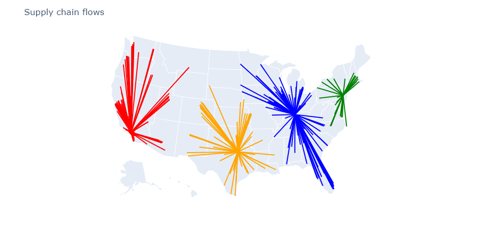
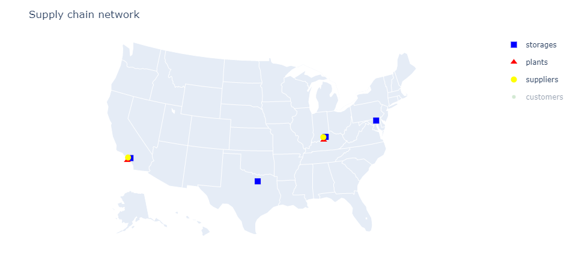

# Locations Optimization
In this section we will see how to find the best network to service customer demand. We will consider a set of 40 possible storage locations and a set of 350 customers both distributed throughout the US. We specify the cost of operating each storage location and the cost of shipping the product from each storage location to each customer. Finally we indicate the demand for each customer. Once this is done we optimize the network.

```@example continue=true
using CSV
using DataFrames
using SupplyChainOptimization

nm = tempname()
url = "https://raw.githubusercontent.com/plotly/datasets/master/2014_us_cities.csv"
download(url, nm)
us_cities = CSV.read(nm, DataFrame)
rm(nm)

sort!(us_cities, [:pop], rev=true)

sc = SupplyChain(1)

product = Product("Product 1")
add_product!(sc, product)

for r in eachrow(first(us_cities, 40))
    storage = Storage("Storage $(r.name)", Location(r.lat + 0.2, r.lon + 0.2, r.name); 
            fixed_cost= 2_000_000 + r.pop / 2, 
            opening_cost=0.0, 
            closing_cost=0.0, 
            initial_opened=false)
    add_product!(storage, product; initial_inventory=100_000)
    add_storage!(sc, storage)
end

for (i, r) in enumerate(eachrow(first(us_cities, 350)))
    customer = Customer("customer $i", Location(r.lat, r.lon, r.name))
    add_customer!(sc, customer)
    add_demand!(sc, customer, product; demand=[r.pop / 10_000])
end

for c in sc.customers, s in sc.storages
    add_lane!(sc, Lane(s, c; unit_cost=haversine(s.location, c.location) / 250))
end

optimize_network!(sc)
```

After optimizing the network we can visualize the results.

```@example
plot_flows(sc; showlegend=false)
```



In the next example, we optimize a more complete network: we will consider where to build plants, storage locations to service customers and which suppliers to buy from. The customers consume one type of product which is produced by the plants and stored at the storage locations. The plants need a different product as raw material. This product is sourced from suppliers. 

The process is similar to the previous example: we setup the network using the built-in concepts, call the optimize_network! function and query the results. 

```@example
using CSV
using DataFrames
using SupplyChainOptimization

nm = tempname()
url = "https://raw.githubusercontent.com/plotly/datasets/master/2014_us_cities.csv"
download(url, nm)
us_cities = CSV.read(nm, DataFrame)
rm(nm)

sort!(us_cities, [:pop], rev=true)

sc = SupplyChain(1)

product1 = Product("Product 1")
product2 = Product("Product 2")
add_product!(sc, product1)
add_product!(sc, product2)

for r in eachrow(first(us_cities, 20))
    supplier = Supplier("Supplier $(r.name)", Location(r.lat + 0.2, r.lon - 0.2, r.name))
    add_product!(supplier, product1; unit_cost=1.0)
    add_supplier!(sc, supplier)
end

for r in eachrow(first(us_cities, 20))
    plant = Plant("Plant $(r.name)", Location(r.lat - 0.2, r.lon - 0.2, r.name); 
            fixed_cost= 6_000_000 + r.pop / 2, 
            opening_cost=0.0, 
            closing_cost=0.0, 
            initial_opened=false)
    add_product!(plant, product2; bill_of_material=Dict{Product, Float64}(product1 => 1.0), unit_cost=1.0)
    add_plant!(sc, plant)
end

for r in eachrow(first(us_cities, 20))
    storage = Storage("Storage $(r.name)", Location(r.lat + 0.2, r.lon + 0.2, r.name); 
            fixed_cost= 2_000_000 + r.pop / 2, 
            opening_cost=0.0, 
            closing_cost=0.0, 
            initial_opened=false)
    add_product!(storage, product2; initial_inventory=0)
    add_storage!(sc, storage)
end

for (i, r) in enumerate(eachrow(first(us_cities, 350)))
    customer = Customer("customer $i", Location(r.lat, r.lon, r.name))
    add_customer!(sc, customer)
    add_demand!(sc, customer, product2; demand=[r.pop / 10_000])
end

for s in sc.suppliers, p in sc.plants
    add_lane!(sc, Lane(s, p; unit_cost=haversine(s.location, p.location) / 750))
end

for p in sc.plants, s in sc.storages
    add_lane!(sc, Lane(p, s; unit_cost=haversine(p.location, s.location) / 750))
end

for c in sc.customers, s in sc.storages
    add_lane!(sc, Lane(s, c; unit_cost=haversine(s.location, c.location) / 250))
end

optimize_network!(sc)
```

The network can be visualized (see below). We can see that the optimal network has two clusters of plants/storage locations; one to service the West coast and one to service the East coast. Additionally two smaller storage locations are used as hubs to reduce overall costs.

